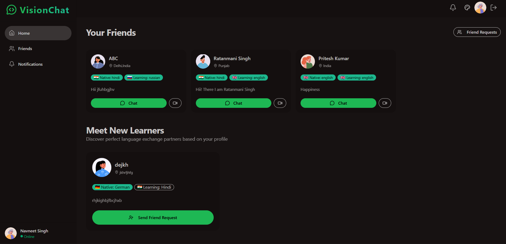
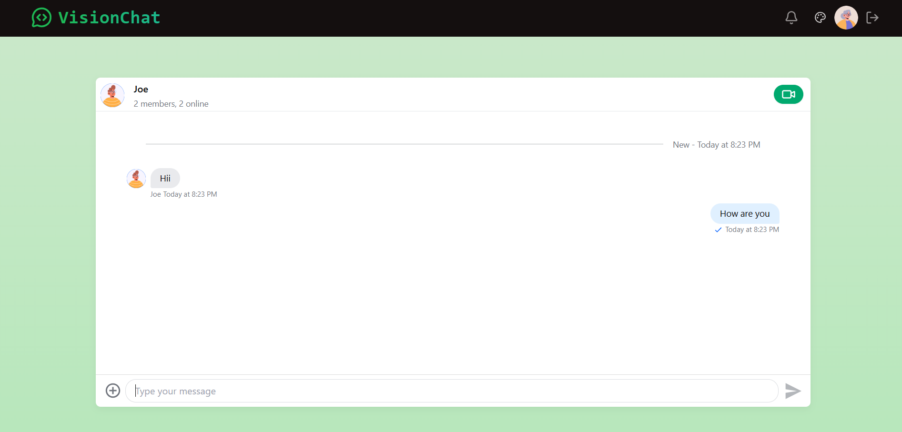
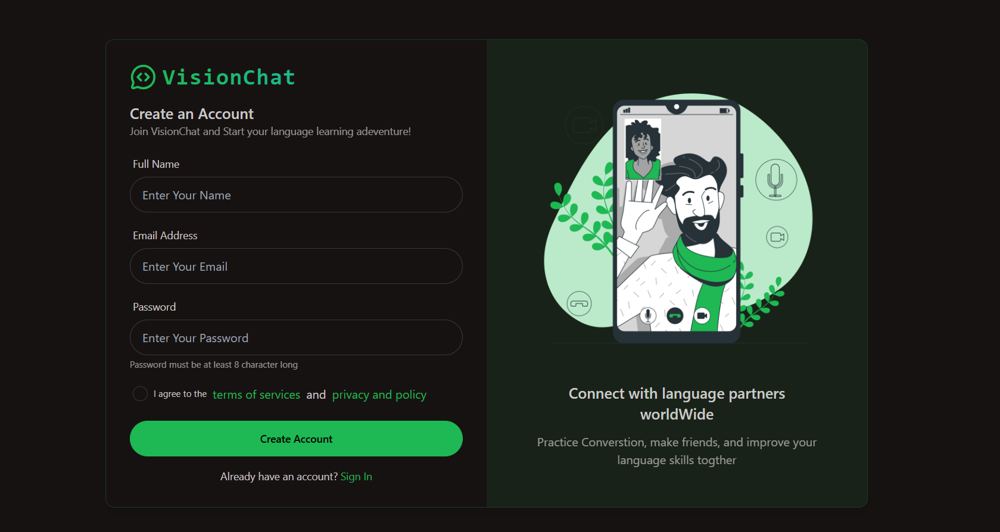

# Real-Time Chat Application

A modern, feature-rich real-time chat application built with React, Node.js, and Stream.io. This application provides seamless messaging, video calling, friend management, and notification features with a beautiful, responsive UI.

- [Live Demo](https://visionchat-one.vercel.app)


## 🖼️ Screenshots

| Home Page | Chat Page | Login page|
|-----------|----------------|-----------------|
|  |  |  |

## 🚀 Features

### Core Features
- 🔐 **User Authentication** - Secure signup/login with JWT tokens
- 💬 **Real-time Messaging** - Instant messaging powered by Stream Chat
- 📞 **Video Calling** - High-quality video calls using Stream Video SDK
- 👥 **Friend Management** - Send, receive, and manage friend requests
- 🔔 **Notifications** - Real-time notifications for messages and friend requests
- 🎨 **Theme Support** - Multiple themes with DaisyUI
- 📱 **Responsive Design** - Works seamlessly on desktop and mobile devices

### Additional Features
- 🎬 **User Onboarding** - Smooth onboarding experience for new users
- 🔍 **User Search** - Find and connect with other users
- 🛡️ **Protected Routes** - Secure navigation based on authentication status
- ⚡ **Fast Performance** - Optimized with Vite and React Query
- 🎭 **Modern UI** - Built with Tailwind CSS and DaisyUI components

## 🛠️ Tech Stack

### Frontend
- **React 19** - Modern React with latest features
- **Vite** - Lightning-fast build tool
- **Tailwind CSS** - Utility-first CSS framework
- **DaisyUI** - Beautiful component library for Tailwind
- **Stream Chat React** - Real-time chat components
- **Stream Video React SDK** - Video calling functionality
- **React Router** - Client-side routing
- **React Query** - Server state management
- **Zustand** - Lightweight state management
- **Axios** - HTTP client
- **React Hot Toast** - Beautiful notifications
- **Lucide React** - Beautiful icons

### Backend
- **Node.js** - JavaScript runtime
- **Express.js** - Web application framework
- **MongoDB** - NoSQL database with Mongoose ODM
- **Stream Chat** - Real-time messaging backend
- **JWT** - JSON Web Tokens for authentication
- **bcryptjs** - Password hashing
- **CORS** - Cross-origin resource sharing
- **Cookie Parser** - Parse HTTP cookies

## 📁 Project Structure

```
chating-app/
├── client/                     # Frontend React application
│   ├── public/                 # Static assets
│   ├── src/
│   │   ├── components/         # Reusable UI components
│   │   ├── Pages/             # Application pages/routes
│   │   ├── hooks/             # Custom React hooks
│   │   ├── lib/               # Utility functions and API calls
│   │   ├── store/             # State management
│   │   └── data/              # Static data
│   ├── package.json
│   └── vite.config.js
└── server/                     # Backend Node.js application
    ├── config/                 # Database and external service configs
    ├── controllers/           # Route handlers
    ├── middleware/            # Custom middleware
    ├── model/                 # Database models
    ├── routes/                # API routes
    ├── package.json
    └── server.js
```

## 🚀 Getting Started

### Prerequisites
- Node.js
- MongoDB database
- Stream.io account (for chat and video features)

### Environment Variables

Create `.env` files in both client and server directories:

#### Server (.env)
```env
PORT=4000
MONGODB_URI=your_mongodb_connection_string
JWT_SECRET=your_jwt_secret_key
NODE_ENV=development
CORS_ORIGIN=http://localhost:5173

# Stream.io credentials
STREAM_API_KEY=your_stream_api_key
STREAM_API_SECRET=your_stream_api_secret
```

#### Client (.env)
```env
VITE_API_URL=http://localhost:4000/api
VITE_STREAM_API_KEY=your_stream_api_key
```

### Installation & Setup

1. **Clone the repository**
   ```bash
   git clone https://github.com/Navneetsingh04/chating-app.git
   cd chating-app
   ```

2. **Install server dependencies**
   ```bash
   cd server
   npm install
   ```

3. **Install client dependencies**
   ```bash
   cd ../client
   npm install
   ```

4. **Set up Stream.io**
   - Create an account at [Stream.io](https://getstream.io/)
   - Create a new app
   - Get your API key and secret
   - Add them to your environment variables

5. **Set up MongoDB**
   - Create a MongoDB database (local or cloud)
   - Add the connection string to your server .env file

### Running the Application

1. **Start the server** (from the server directory)
   ```bash
   npm run dev
   ```
   Server will run on http://localhost:4000

2. **Start the client** (from the client directory)
   ```bash
   npm run dev
   ```
   Client will run on http://localhost:5173

## 📱 Usage

1. **Sign Up**: Create a new account with email and password
2. **Onboarding**: Complete your profile setup
3. **Find Friends**: Search for users and send friend requests
4. **Chat**: Start conversations with your friends
5. **Video Calls**: Initiate video calls during chats
6. **Notifications**: Stay updated with real-time notifications


## 📝 License

This project is licensed under the MIT License - see the [LICENSE](LICENSE) file for details.

## 👨‍💻 Author

**Navneet Singh**
- GitHub: [@Navneetsingh04](https://github.com/Navneetsingh04)

## 🙏 Acknowledgments

- [Stream.io](https://getstream.io/) for providing excellent chat and video APIs
- [Tailwind CSS](https://tailwindcss.com/) for the utility-first CSS framework
- [DaisyUI](https://daisyui.com/) for beautiful component library
- [React](https://reactjs.org/) team for the amazing framework
